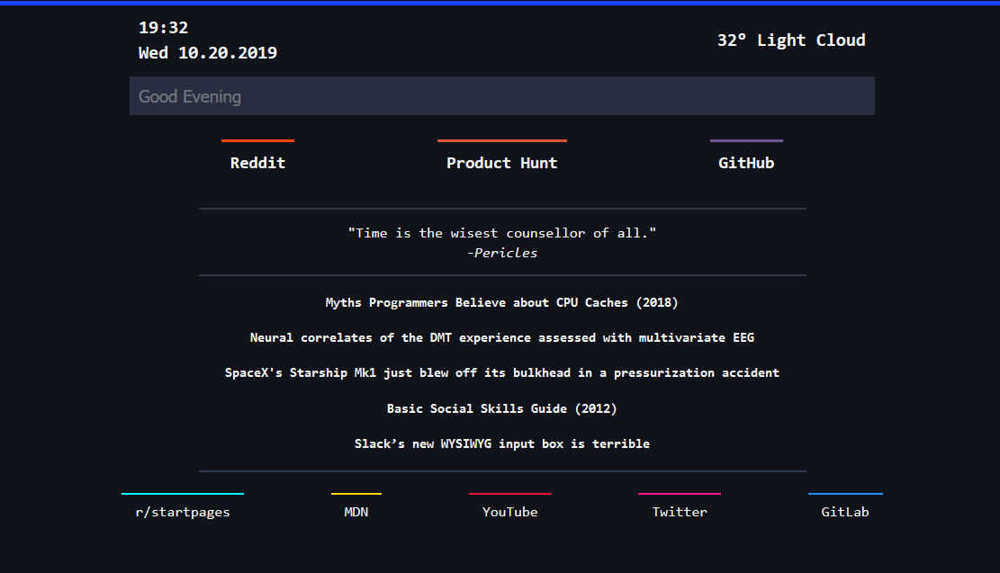

# start

Simple and beautiful personal browser homepage

## About

+ [Site](https://ethanjustice.github.io/start)
+ [Demo](https://ethanjustice.github.io/start/demo)

## Downloading

+ [GitHub](https://github.com/EthanJustice/start)
+ [Releases](https://github.com/EthanJustice/start/releases)

Cloning: `git clone https://github.com/EthanJustice/start`

## Usage

### Set-Up

1. Navigate to the `script.js` file or equivalent.
2. Edit the `quickLauncherList` or `linksItems` JSON variables.
3. Save the file

### Object Values

| Name | Use |
| ---- | ---- |
| displayText | Text displayed on screen |
| destination | URL of link |
| color | color at the top border |
| shortcut | specifies a shortcut to open it (accepts keyCode numbers only) |
